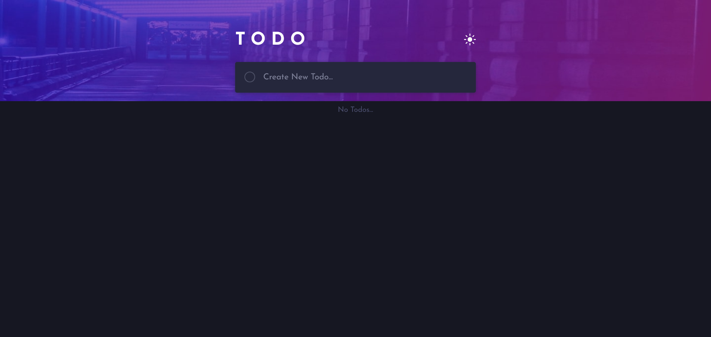
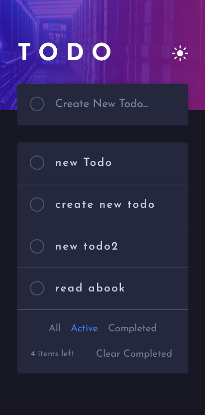
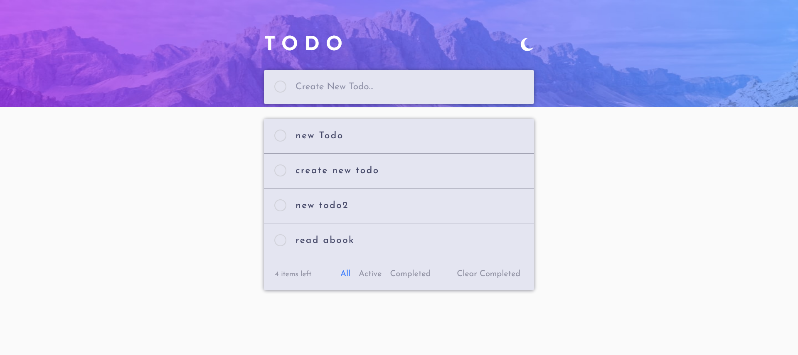

# Frontend Mentor - Todo app solution

[Todo app challenge on Frontend Mentor](https://www.frontendmentor.io/challenges/todo-app-Su1_KokOW).

## Table of contents

- [Overview](#overview)
  - [The challenge](#the-challenge)
  - [Screenshot](#screenshot)
- [My process](#my-process)
  - [Built with](#built-with)
  - [What I learned](#what-i-learned)
  - [Continued development](#continued-development)
- [Author](#author)

## Overview

In this new project, I believe it will greatly enhance our productivity and daily task management capabilities: Todo app built using ReactJS and greate State Management library

This application allows users to efficiently manage their tasks with features such as adding, deleting, and toggling the completion status of todos. The app also includes local storage functionality to persist todos between sessions. 🌟

### The challenge

The proposed Todo app will be a user-friendly, efficient, and scalable solution designed to help our team manage tasks more effectively. The app will include the following features:

- Task Creation and Management: Users can add, and delete tasks.
- Task Completion Tracking: Users can mark tasks as completed and view completed tasks.
- Data Persistence: Tasks will be saved locally or in a database to ensure data is not lost
- Filter by Completion Status: Users can filter tasks to view only completed or incomplete tasks.
- Clear all completed todos
- See hover states for all interactive elements on the page
- Theme Toggling: Users can switch between light and dark themes for a better user experience.
- Responsive Design: The application is fully responsive, providing an optimal user experience on both desktop and mobile devices.

### Screenshot

## My process

The app developed by ReactJS, a popular JavaScript library for building user interfaces, and Zustand, a small, fast, and scalable state management solution. This combination offers several advantages, including:

- Component-Based Architecture: Allows for reusable components, making the app more maintainable and scalable.

- Efficient State Management: Zustand provides a simple and flexible way to manage state, improving the app’s performance and scalability.

- Store and manage your States from one place

### Built with

- Semantic HTML5 markup
- Mobile-first workflow
- [React](https://reactjs.org/) - JS library
- [Zustand](https://zustand-demo.pmnd.rs/) - ReactJs State Management library
- [Styled Components](https://styled-components.com/) - For styles

### What I learned

This project has been a fantastic learning experience, allowing me to deepen my understanding of React and state management. I'm excited to continue building more projects and expanding my skills in web development.

### Continued development

in next Version of this app , i will add the ability of drag and drop items and reorder them into the todolist and save the updating .

## Author

- LinkedIn - [Khaled Sameh](https://www.linkedin.com/in/khaled-sameh-940295272/)
- Frontend Mentor - [@khaled-sameh-dev](https://www.frontendmentor.io/profile/khaled-sameh-dev)
- Gmail - [khaledsameh158@gmail.com](https://khaledsameh158@gmail.com)
